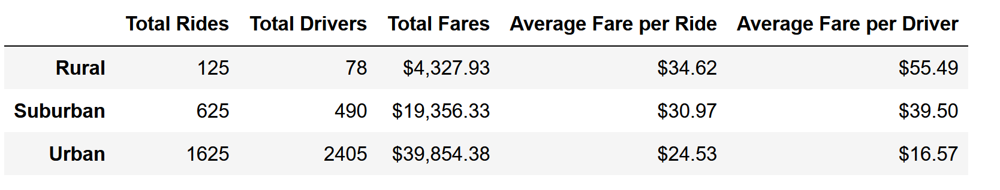

# PyBer with Matplotlib

## Overview of Project
The project is  to create a summary DataFrame of the ride-sharing data by city type. Then, using Pandas and Matplotlib, a multiple-line graph that shows the total weekly fares for each city type will be created.

### Purpose
To summarize how the data differs by city type and how those differences can be used by decision-makers at PyBer.

### Performing programming.
For solving this task we will use Python programming with an additional Jupyter notebook tool and additional libraries such as Panda and Numpy.

### Challenges and Difficulties Encountered
Using Jupiter and additional libraries requires additional education which takes some time.

## Results
The analysis resulted in table presented bellow

According this statistic we can conclude:
- Urban cities have the highest demand in drivers and rides and, as result have the highest total fires ($39,854.38)
- Because of high demand urban cities have the highest number of drivers (1625)
- Rural cities have the lowest numbers of drivers and rides
- However, rural cities have the highest average fare per ride and driver ($34.62 and $55.49) while the urban cities have the lowest ($24.53 and $16.57)
- Urban cities are the only cities where the total number of drivers exceeds the total rides.

## Summary
The result shows that the ratio of total rides to total drivers affects the average fare so the rural cities with the ratio ~1.7 have the highest fires. In addition, the urban cities are the only cities where the total number of drivers exceeds the total rides so the recommendation is to reduce the number of drivers in urban cities. The rural cities have the highest fires while the urban cities have the highest total so during the company growth the rural cities should be considered and prioritized in some cases. The number of rides is exceeded in Rural and Suburban cities so the recommendation is to increase the number of drivers in order to fulfill the demand.
